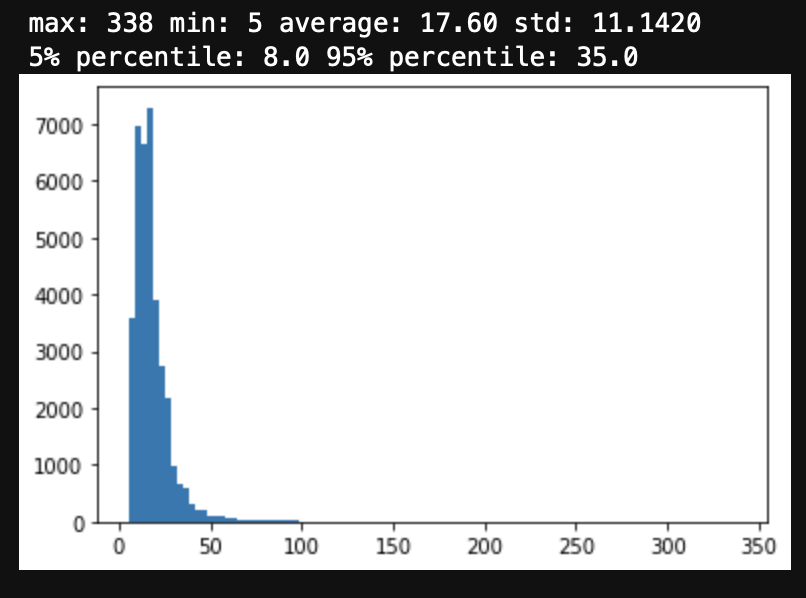
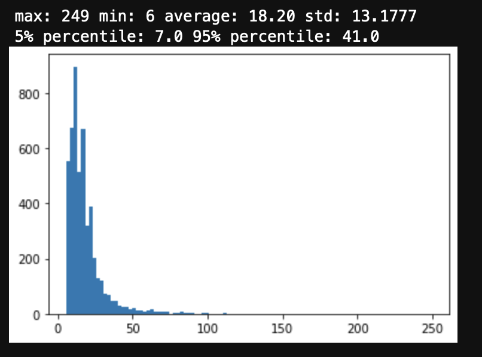
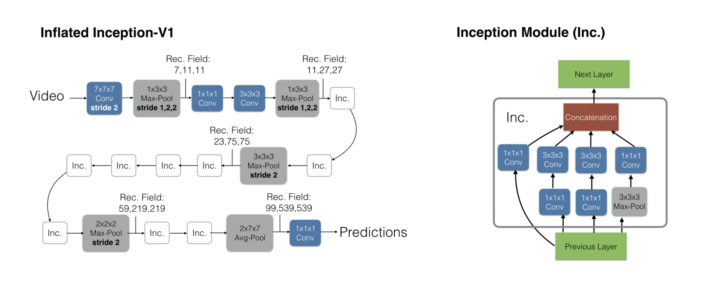
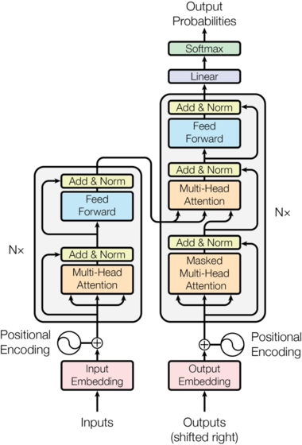

# video2text_abr

## Dataset

### MVAD

videos with captions

- #### Caption Statistics

<figure>

<figcaption>Train caption statistics</figcaption>

<figcaption>Test caption statistics</figcaption>
</figure>

## Model

Extract feature with I3D_rgb, generate caption with transformer

### I3D_rgb

<a href="https://arxiv.org/abs/1705.07750">Quo Vadis, Action Recognition? A New Model and the Kinetics Dataset </a>

1. Resize to (channel, seq, 256, 256)
2. Center Crop (channel, seq, 224, 224)
3. Extract feature with I3D_rgb
   - 8frames -> 1
   - (3, seq, 224, 224) -> (ceil(seq / 8), 1024)

**Output: (seq, feature-1024)**

- #### Feature Statistics

<figure>

<figcaption>Train feature statistics</figcaption>

<figcaption>Test feature statistics</figcaption>
</figure>

### Transformer

<a href="https://arxiv.org/abs/1706.03762">Attention is All You Need</a>

- As inpus are not sentence, input embedding is removed from encoder.
- Original transformer encoder is made of 6 encoder layers. But as features are already extracted from I3D_rgb, used less encoder layers. Also captions lengths are not that long, used less decoder layers whereas original has 6 layers.
- Original optimizer's learning rate scheduler is too large for video features.
